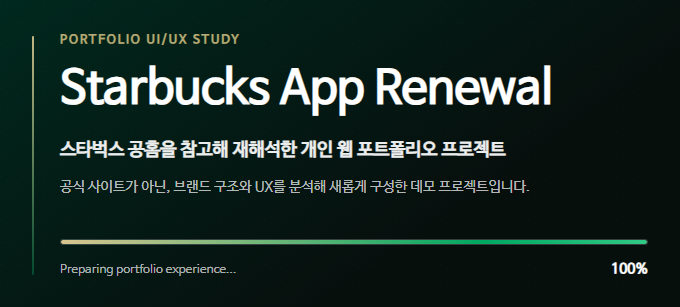
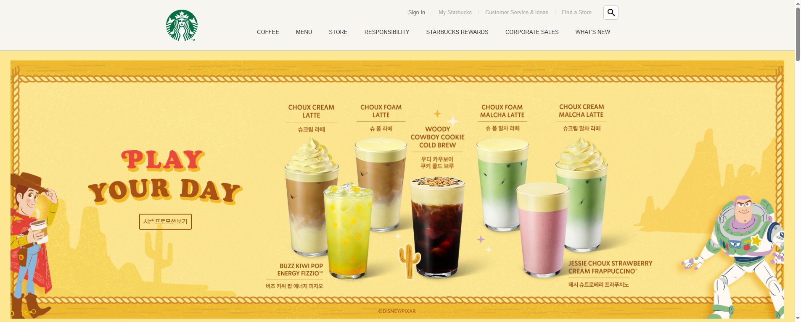
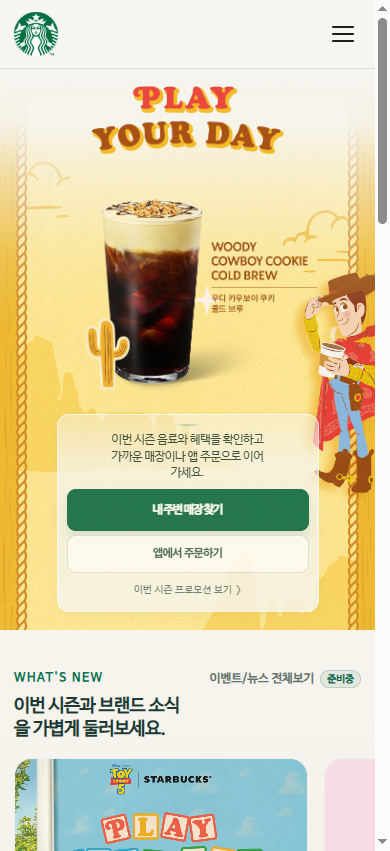

# Starbucks Mobile UX Renewal

  
  
  
  

스타벅스 스타일 웹 프로젝트를 기반으로 시작해, 공홈 구조 분석과 직접 재구현을 거쳐 모바일 중심 UX 리뉴얼 프로젝트로 발전시킨 포트폴리오 저장소입니다.

현재 `main` 브랜치는 기본 브랜치이자 프로덕션 기준 브랜치이며, 배포 중인 결과물은 아래 주소에서 확인할 수 있습니다.

## 프로젝트 한눈에 보기

| 항목 | 내용 |
| --- | --- |
| 프로젝트 성격 | 스타벅스 스타일 웹 UI/UX 리뉴얼 포트폴리오 |
| 현재 기준 브랜치 | `main` |
| 현재 릴리즈 | [v0.2.1](https://github.com/ITb4ng/starbucks-app/releases/tag/v0.2.1) |
| 개발 기준 브랜치 | `dev` |
| 배포 환경 | Netlify |
| 구현 방식 | HTML, CSS, JavaScript 기반 정적 웹 |
| 주요 방향 | 모바일 우선 정보 구조, 행동형 CTA, 접근성 흐름, 반응형 레이아웃 |

## 배포 및 미리보기

- Production (main): https://itb4ng-siri.netlify.app
- Release: [v0.2.1](https://github.com/ITb4ng/starbucks-app/releases/tag/v0.2.1)
- 주요 화면: 메인 페이지, 로그인 페이지, 모바일 전용 흐름, 프로모션/리워드/스토어 섹션
- 공유 미리보기: Open Graph, Twitter Card, iOS/Safari 아이콘 메타를 현재 배포 주소 기준으로 정리

### 미리보기 스크린샷

| Intro Splash | Desktop Main |
| --- | --- |
|  |  |

| Mobile Main |
| --- |
|  |

## 프로젝트 소개

이 프로젝트는 단순히 스타벅스 공홈을 따라 만드는 클론 코딩에서 멈추지 않고, 실제 서비스의 화면 구조와 사용자 흐름을 분석한 뒤 직접 재구성하는 방향으로 확장되었습니다.

초기에는 강의 기반 퍼블리싱 결과물로 출발했지만, 이후 스타벅스 공식 웹사이트의 정보 구조, 프로모션 노출 방식, 리워드/스토어/메뉴 탐색 흐름을 참고해 현재 프로젝트 목적에 맞게 다시 설계했습니다.

현재는 데스크톱 중심의 공홈형 화면을 그대로 유지하는 것보다, 모바일 사용자가 더 빠르게 원하는 행동에 도달할 수 있도록 섹션 순서, CTA 위계, 내비게이션, 푸터, 접근성 흐름을 재정비한 상태입니다.

이 저장소는 공식 스타벅스 서비스가 아니며, 학습과 포트폴리오 목적의 개인 리뉴얼 프로젝트입니다.

## 프로젝트 히스토리

1. 강의 기반 스타벅스 스타일 웹 페이지 제작으로 시작
2. 기존 결과물을 바탕으로 HTML, CSS, JavaScript 구조를 직접 보정
3. 공식 사이트 흐름을 분석해 프로모션, 리워드, 스토어, 메뉴 탐색 구조를 재구성
4. 모바일 사용 흐름을 기준으로 Hero CTA, `mobile-flow`, `What's New`, footer 구조를 리뉴얼
5. 접근성, 링크 정책, 공유 메타, Safari 아이콘, 배포 기준 URL을 정리
6. `main`을 프로덕션 기준 브랜치로 정리하고, `dev`는 통합 개발 기준 브랜치로 분리

## 작업 기록 문서

`dev` 리뉴얼 기획 단계부터 기능별 개선, 릴리스 전 점검, `main` 프로덕션 기준 정리에 이르기까지의 작업 흐름은 `docs/` 내부 문서로 구성했습니다.

날짜별 작업 기록은 실제 수정 흐름을 따라 남겼고, 링크 정책과 포커스 흐름처럼 반복해서 참고해야 하는 기준은 별도 문서로 분리했습니다.

- 날짜별 작업 기록: `docs/2026-04-09.md`부터 `docs/2026-04-22.md`까지
- 링크 정책 기준: `docs/link-policy.md`
- 포커스 흐름 기준: `docs/focus-flow-guidelines.md`
- 작업 기록 템플릿: `docs/work-template.md`
- 회고 문서: `docs/first-reserve-retrospective.md`

## 현재 상태

현재 `main` 브랜치는 이 저장소의 기본 브랜치이며, Netlify 프로덕션 배포 기준입니다.

현재 공개 기준은 [v0.2.1](https://github.com/ITb4ng/starbucks-app/releases/tag/v0.2.1) 릴리즈와 연결됩니다.

`dev` 브랜치는 기능 개발과 통합 검증을 위한 개발 기준 브랜치로 사용합니다. 기능 단위 작업은 `feature/*`에서 진행하고, 배포 전 안정화가 필요할 때 `release/*` 브랜치에서 최종 점검합니다.

`master` 브랜치는 현재 공개 기준이 아니라 초기 작업물과 이전 배포 흐름을 보존하는 레거시 브랜치입니다.

## 왜 이 프로젝트를 리뉴얼했는가

초기 결과물은 데스크톱 공홈 화면을 충실히 재현하는 데 초점이 있었습니다. 하지만 실제 사용 맥락에서는 모바일 진입, 빠른 탐색, 행동형 CTA, 로그인/리워드/스토어 흐름의 우선순위가 더 중요하다고 판단했습니다.

그래서 프로젝트의 목표를 "화면을 비슷하게 만드는 것"에서 "사용자가 어떤 행동으로 이어지는지 설명할 수 있는 구조를 만드는 것"으로 옮겼습니다.

리뉴얼 과정에서는 기존 마크업을 무조건 폐기하지 않고, 유지 가능한 구조는 살리면서 모바일 중심 정보 흐름과 접근성 기준을 단계적으로 보강했습니다.

## 핵심 개선 방향

- 모바일 우선 정보 흐름: 모바일에서 핵심 CTA와 주요 서비스 섹션이 먼저 보이도록 구조를 재배치
- 행동형 CTA 강화: `내 주변 매장 찾기`, `앱에서 주문하기`, `리워드 소개`처럼 실제 행동으로 이어지는 버튼 위계를 정리
- 내비게이션 개선: 모바일 드로어, 검색, 아코디언 메뉴, 닫기 흐름을 터치 환경에 맞게 보정
- 접근성 흐름 보강: skip link, 포커스 이동, 모달/메뉴 닫기, 탭 이동 순서를 실제 사용 흐름 기준으로 정리
- 링크 정책 정리: 실제 이동 가능한 링크와 준비 중인 항목을 구분해 무의미한 `javascript:void(0)` 사용을 줄임
- 공유 품질 개선: OG/Twitter 메타, 1200x630 공유 이미지, favicon, apple touch icon을 배포 주소 기준으로 정리
- 반응형 안정화: 데스크톱 구조를 유지하면서 모바일 전용 섹션과 footer 흐름을 별도로 구성

## 브랜치 전략

| 브랜치 | 역할 |
| --- | --- |
| `main` | 현재 프로덕션 기준 브랜치. Netlify 배포 기준이며 저장소 대표 README도 이 브랜치를 기준으로 작성 |
| `dev` | 통합 개발 기준 브랜치. 기능 작업을 모아 검증하는 개발 기준선 |
| `master` | 초기 작업물과 이전 배포 흐름을 보존하는 레거시 브랜치 |
| `feature/*` | 기능 단위 작업 브랜치. UI 개선, 접근성 보정, 섹션 리뉴얼 등을 개별 단위로 진행 |
| `release/*` | 배포 전 최종 점검 브랜치. 공유 메타, 링크, 반응형, 접근성 등 릴리스 품질 확인 |
| `hotfix/*` | 배포 후 긴급 수정 브랜치. 프로덕션 문제를 빠르게 보정한 뒤 main에 반영 |

## 기술 스택

- HTML5
- CSS3
- JavaScript
- GSAP
- ScrollMagic
- Swiper
- Lodash
- Netlify

## 앞으로의 개선 방향

현재 반영된 방향성:

- 모바일 우선 CTA와 섹션 순서 정리
- 모바일 내비게이션, 검색, footer 구조 보정
- 접근성 흐름과 링크 정책 정리
- 공유 미리보기와 배포 URL 기준 메타 정리
- 로그인 페이지와 메인 페이지의 공통 헤더/푸터 기준 정리

앞으로의 개선 포인트:

- 실제 기기 기준 모바일 회귀 테스트 강화
- 데스크톱과 모바일 간 정보 우선순위 추가 정리
- 준비 중인 링크와 실제 이동 링크의 상태 문서화 유지
- README와 작업 기록 문서의 인코딩 및 가독성 정리
- 배포 후 공유 플랫폼 캐시 갱신 여부 확인

## 정리

이 저장소는 스타벅스 스타일 웹 페이지를 출발점으로 삼아, 모바일 사용 흐름과 접근성을 중심으로 다시 설계한 웹 포트폴리오 프로젝트입니다.

`main`은 현재 프로덕션 기준 브랜치, `dev`는 통합 개발 기준 브랜치, `master`는 레거시 보존 브랜치로 역할을 나누어 운영합니다.

프로젝트의 핵심은 단순한 화면 재현이 아니라, 공식 사이트의 흐름을 분석하고 현재 프로젝트의 목적에 맞게 사용자 행동 중심 구조로 재구성하는데 있습니다.
